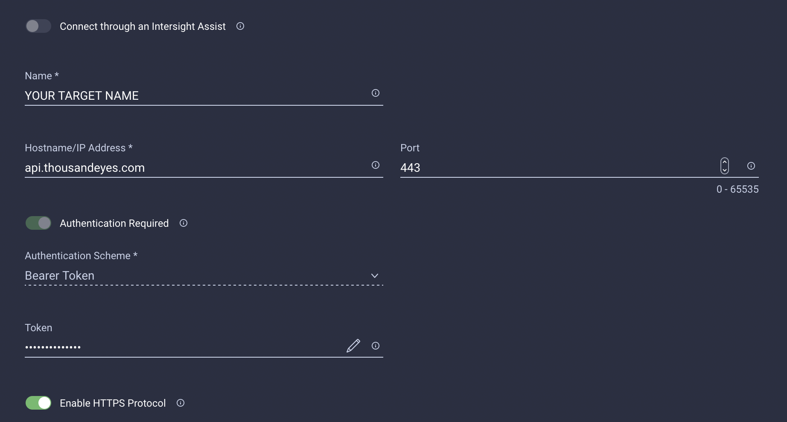

# Intersight Cloud Orchestrator - ThousandEyes

## Use Case
These tasks and workflows enable you to create tests using Cisco ThousandEyes.

## Overview
Right now, this repository contains the following tasks and workflows:

### Tasks
<table>
  <tr>
    <th>Object</th>
    <th>Operation</th>
    <th>Maintainer</th>
    <th>Status</th>
    <th>Link</th>
  </tr>
  
  <!-- Test: Web - HTTP Server -->
  <tr>
    <td>Test: Web - HTTP Server</td>
    <td>Create</td>
    <td><a href="https://github.com/3191110276">Michael Maurer</a></td>
    <td>:white_check_mark: Implemented</td>
    <td><a href="./tasks/CreateTest_Web-HTTPServer.json">Link</a></td>
  </tr>
  
  <!-- Test: Web - Page Load -->
  <tr>
    <td>Test: Web - Page Load</td>
    <td>Create</td>
    <td><a href="https://github.com/3191110276">Michael Maurer</a></td>
    <td>:white_check_mark: Implemented</td>
    <td><a href="./tasks/CreateTest_Web-PageLoad.json">Link</a></td>
  </tr>
  
  <!-- Any Test -->
  <tr>
    <td>Test</td>
    <td>Delete</td>
    <td><a href="https://github.com/3191110276">Michael Maurer</a></td>
    <td>:white_check_mark: Implemented</td>
    <td><a href="./tasks/DeleteTest.json">Link</a></td>
  </tr>
</table>

### Workflows
<table>
  <tr>
    <th>Action</th>
    <th>Maintainer</th>
    <th>Status</th>
    <th>Link</th>
  </tr>
  
  <tr>
    <td>Create a new ThousandEyes test</td>
    <td><a href="https://github.com/3191110276">Michael Maurer</a></td>
    <td>:white_check_mark: Implemented</td>
    <td><a href="./workflows/CreateThousandEyesTest.json">Link</a></td>
  </tr>
</table>

## Prerequisites
You will need a Cisco ThousandEyes account.

## Claimed Targets
To enable the tasks, you will need to claim an "HTTP Endpoint" Target for ThousandEyes in Intersight with your personal credentials.
 

## Notes

